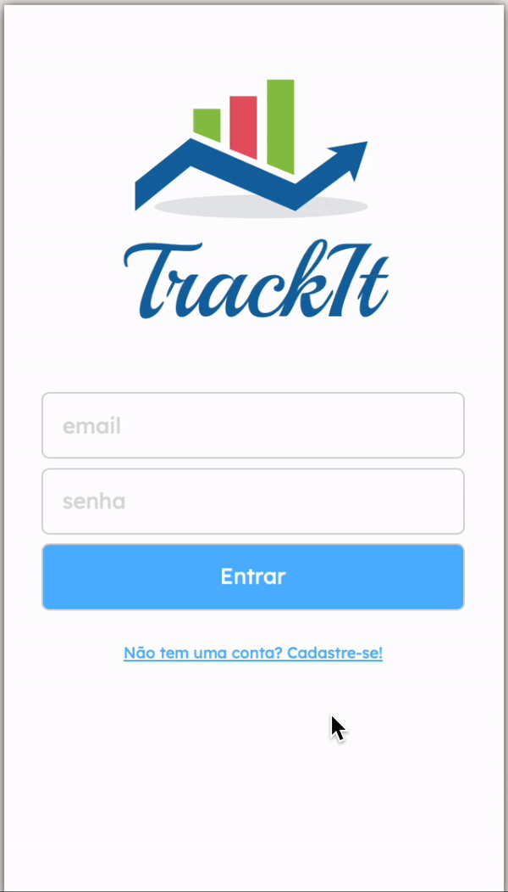

# Track-It

Design of a complete habit tracking application (for mobile) ! With the right to register, login and many libraries !



Try it out now at https://projeto11-trackit-fawn.vercel.app

## About

This is an web application for mobile with which lots of people can manage their own habits. Below are the implemented features:

- Sign Up
- Login
- List all habits for a user
- Add habit
- Delete habit

By using this app any user can keep track of their habits for the week !

## Technologies
The following tools and frameworks were used in the construction of the project:<br>
<p>
  
  
  
  
  
</p>

## How to run

1. Clone this repository
2. Install dependencies
```bash
npm i
```
3. Run the front-end with
```bash
npm start
```
4. You can optionally build the project running
```bash
npm run build
```
5. Finally access http://localhost:3000 on your favorite browser (unless it is Internet Explorer. In this case, review your life decisions)
